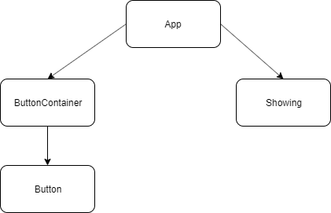

# IT2810 project 2

## Krav til funksjonalitet

### Innhold
Prosjektet har tilsammen 12 SVG-filer (for bildene), 12 mp3-filer (for lyden) og 3 json filer (for diktene).
For hver JSON fil er det fire dikt. Gruppen tolket oppgaven slik at dette var greit da hver tekst skulle ha tre kategorier, og tekst ikke tar så mye lagringsplass.

Bildene er hentet fra https://undraw.co/ som lager open-source svg filer.
MP3-filene er hentet fra: https://freesound.org

### Oppsett
Siden har en header med navn på utstillingen. Videre er nettsiden delt i to. På venstresiden velger man mellom tre kategorier, for til slutt å velge alternativer for ulike kombinasjoner.
På høyresiden er kombinasjonen av bilde, tekst og lyd lagret inn i en ramme. 

Det er også implementert responsiv design, som gjør at høyresiden wrappes under venstresiden når bredden på siden blir tilstrekkelig liten. (mer om dette under)

### Lagring
Filene er lagret lokalt i sine respektive mapper i /public/assets/ mappen i prosjektet.

## Krav til teknologi

### React

Vi bygget alle komponentene fra bunn av i prosjektet vårt. Vi benyttet oss av både klasse komponenter og funksjonelle komponenter. 

Dette er komponentstrukturen vi bruker:

### Ajax

### HTML Web Storage

### Responsive web design
Utstillingen har et responsivt design der gruppen har tilpasset utstillingen for ulike enheters størrelser.

Siden er som nevnt ovenfor delt i to, der venstre siden består av knapper, mens høyre er selve utstillingen. Ved større skjermer så vises disse to seksjonene ved siden av hverandre.

Når skjermen blir tilstrekkelig liten, som feks. på en mobil, vil høyre seksjon wrappes under venstre seksjon. På denne måten kan brukeren velge kategorier og alternativer for å se utstillingen.

Som følge av dette får vi dermed en flytende og fleksibel layout.

Høyreseksjonen består av tre elementer: bilde, tekst, og lyd. Disse elementene ligger vertikalt over hverandre, og wrappes ikke. Elementene scaler også godt innad i rammen, eneste unntaket er lydkontrollene i mobilformat. Da er baren for å spole for liten, men gruppen konkluderte med at det ikke er mange som spoler i lydfiler som varer i noen sekunder, og da bedre å fokusere på at stopp og spill knappen blir stor nok. 

I prosjektet blir Viewport og media-queries brukt. Viewport blir automatisk definert i React index filen. Media-query blir brukt ved to tilfeller:
- Ved å skalere knapper for de ulike enhetene.
- Selve utstillinge. Når seksjonene på siden wrappes, vil høyreseksjon bli større, for å benytte den nye plassen som elementet får ved wrap.

SVG-bildene som er implementert skalerer også fint avhengig av skjermbredde.

### Node.js og NPM

### Testing

Vi satt opp testing i Jest. For å få Jest til å fungere måtte vi sette opp devDependencies. Vi satt opp en snapshottest på Button komponentene våre. 
Her måtte vi ignorere css filen ved å lage en tom mockup å referere til for alle css filer. 
Dette var det eneste vi testet i Jest da testen ikke skulle være for omfattende og vi derfor ikke så noe poeng i å lage mockups eller shallowrender da dette prosjektet stort sett handlet om oppsett.

Testing av det responsive designet ble utført på laptop (Windows og mac), mobil (iOS og Android) og nettbrett (iPad). På PC testet vi forskjellige bredder på skjermen med Chrome utviklerverktøy. På mobil testet vi i safari og i chrome. På iPad testet vi i safari. 

